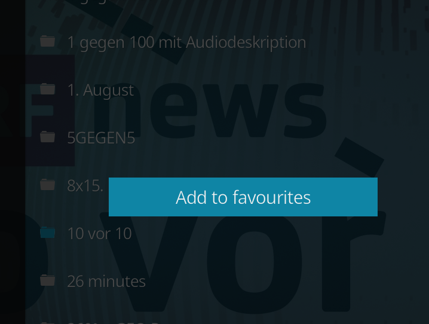
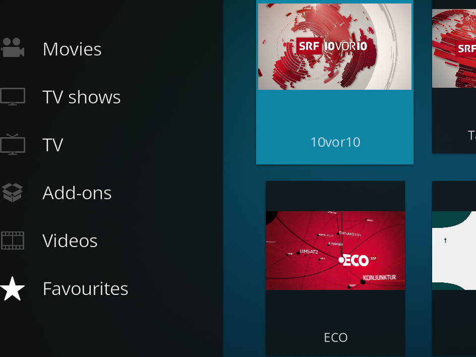

# SRF Replay (another Kodi Plugin)

## Migration
This plugin has been migrated from [SRF Podcast Plugin](https://kodi.wiki/view/Add-on:SRF_Podcast_Plugin) [[source code](https://github.com/ambermoon/xbmc_plugin_video_srf_podcast_ch)] as its development seems to be on hold and unfortunately the plugin is not compatible with the newest Kodi version anymore. Thanks to all the previous developers who maintained the original plugin that I used and appreciated a lot.

## Plugin description
The plugin has been renamed to "SRF Replay". It only supports the SRF channel and the only feature is to list and play all TV shows. All other channels and features from the original plugin have been refactored out. You might ask yourself 'Why?'. Well, never put avocado on a burger! Simple is always best!

## Usage
The plugin can be used most efficiently in combination with favorites. When all the TV Shows are listed, just select your favorite show and open the Kodi context menu (press "c" on your keyboard) and select "Add to favorites".

The TV show just appears and the Kodi favorite menu and can be selected from there without going through the whole list every time.

Every time you select a TV show from your favorites only this show's content will be loaded. You will save click and loading time.

## Installation

### Manual
If you want the latest features after the branch has been tagged then you need to install the code manually.

Just zip the `plugin.video.srf_ch_replay` folder. Alternatively use the ant `build.xml` file and run the default `zip` target to build the zip file.

Go to the add-ons menu and select "Install from zip file". Follow the instructions and at the end select the zip file and install. The "SRF Replay" plugin will appear immediately in your add-ons menu. If you get and error that your usb stick can not be read just restart Kodi and try again.

### Kodi repository
Since the tag 2.0.0 the plugin is in the official [Kodi 19 (Matrix) repository](https://github.com/xbmc/repo-plugins/tree/matrix/plugin.video.srf_ch_replay).

Go to the add-ons menu and select "Install from repository". Search for the plugin and hit "install".