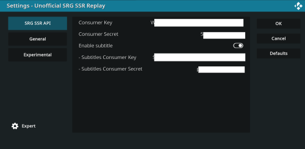

#  Unofficial SRG SSR Replay (another official Kodi add-on) 

## Add-on description
The "Unofficial SRG SSR Replay" add-on implements the new [SRG SSR API](https://developer.srgssr.ch/apis) in order to support more channels and upcoming features. Right now all the official channels (SRF, SRF Info, RTS, RSI and RTR) are supported and these TV shows can be listed and streamed.

Since version 3.0.0 the add-on is in the official [Kodi 19 (Matrix) repository](https://github.com/xbmc/repo-plugins/tree/matrix/plugin.video.srgssr_ch_replay) / [Kodi Add-on Page](https://kodi.tv/addons/matrix/plugin.video.srgssr_ch_replay).

## Migration history
This add-on has been cloned from the [Unofficial SRF Replay](https://kodi.tv/addons/matrix/plugin.video.srf_ch_replay) [[source code](https://github.com/ManBehindMooN/kodi_plugin_video_srf_ch_replay)] repository which originally has been forked from the [SRF Podcast Plugin](https://kodi.wiki/view/Add-on:SRF_Podcast_Plugin) [[source code](https://github.com/ambermoon/xbmc_plugin_video_srf_podcast_ch)]. Thanks to all the previous developers for their beautiful work.

## Feedback for issues/improvements
If you experience any problems or you have any suggestions, then please get in touch with us. The preferred way would be to [open an issue](https://github.com/ManBehindMooN/kodi_plugin_video_srgssr_ch_replay/issues) or [have a discussion](https://github.com/ManBehindMooN/kodi_plugin_video_srgssr_ch_replay/discussions) on our Github.

## Add-on Usage
The add-on is self-explanatory but it can be used most efficiently in combination with favorites and the right view type. 

### Favorites
When all the TV Shows are listed, just select your favorite show and open the Kodi context menu (press "c" on your keyboard) and select "Add to favorites".

The TV show just appears and the Kodi favorite menu and can be selected from there without going through the whole list every time.

Every time you select a TV show from your favorites only this show's content will be loaded. You will save click and loading time.

### View type
Since Kodi 19 it is not allowed anymore for add-ons to set a default view type. So therefore the view type has to be changed manually (or for advances users download/create a skin).

It is recommended to change from the WideList to the InfoWall view type to get most out of the provided image and description for each TV show and episode. 

## Add-on Settings

### General
No explanation provided. You got so far, we are sure you already figured it out ;)

### Official API
Since version 3.0.0 there is a new mandatory setting.

This new setting allows to connect to the official SRG SSR API. This API is documented and supported by SRG SSR and is more stable on the long run and comes with some advantages (like all SRG SSR TV channels are supported; so check the upcoming new versions you might find some new features :-|).

In order to use the new API a consumer key and secret has to be claimed by each user. Therefore an account needs to be opened and some information need to be provided. Yes really, no way around it. So read the next section carefully.

#### Register (private user)
*If you you are not a private user then please get in touch with the SRG SSR yourself. This registration process is described for private users only.*

Open an account [at SRG SSR here](https://developer.srgssr.ch/user/register) and log in.

<kbd></kbd>

Go to "My Apps" and press "ADD A NEW APP". Yep, the blue on.

 <kbd></kbd>

Then put in
> kodi_addon_unofficial_srgssr_replay

> https://kodi.tv/addons/matrix/plugin.video.srgssr_ch_replay
 
and chose
 * SRG-SSR-PUBLIC-API-V2 (Research and Development Plan - for non commercial use)
 
and press "Create App".

<kbd></kbd>
 
Your consumer key and secret have been created.

Now copy the consumer key and secret to Kodi add-on settings. *Just to let you know. Kodi supports remote apps for Android and iOS and makes it easier for some setups to enter text.*
 
Ready to go you are! ~Yoda

## Installation

### Kodi repository
Go to the add-ons menu in your installed Kodi and select "Install from repository". Search for the add-on (just type "srg" or "ssr") and hit "install".

### Manual
If you want the latest features after the branch has been tagged then you need to install the code manually.

Just zip the `plugin.video.srgssr_ch_replay` folder. Alternatively use the ant `build.xml` file and run the default `zip` target to build the zip file.

Go to the add-ons menu and select "Install from zip file". Follow the instructions and at the end select the zip file and install. The "Unofficial SRG SSR Replay" add-on will appear immediately in your add-ons menu. If you get and error that your usb stick can not be read just restart Kodi and try again.